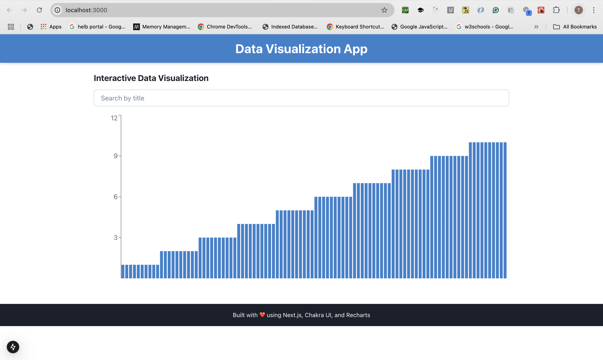
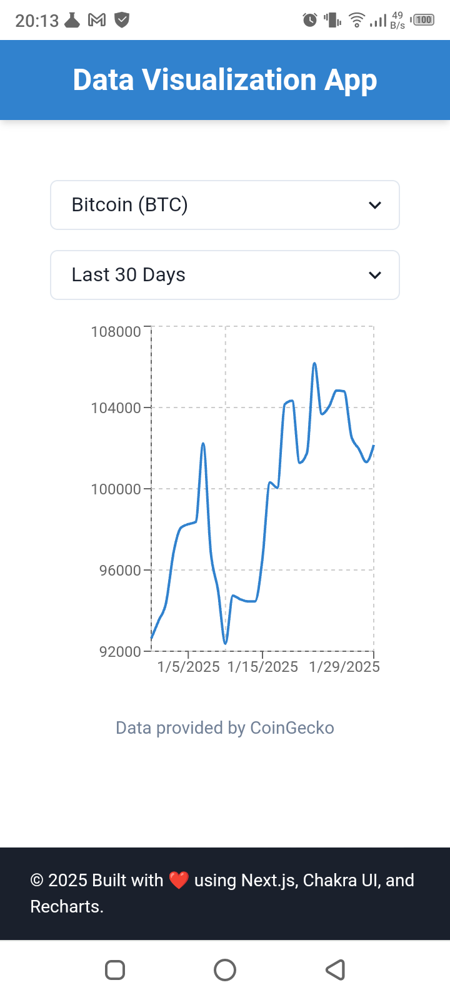

# Frontend Developer Assessment

## Project Description
This is a responsive and interactive web application built using **Next.js**, **Chakra UI**, and **Recharts**. The app fetches cryptocurrency market data from the [CoinGecko API](https://www.coingecko.com/en/api/documentation), visualizes it using charts, and allows users to filter the data to analyze trends over the past 90 days. The application is deployed on **AWS Amplify**.

**Live Demo**: [https://main.d3cgmzqfku2vhx.amplifyapp.com/](https://main.d3cgmzqfku2vhx.amplifyapp.com/)

---

## Features
- **Data Fetching**: Fetches historical market data from the CoinGecko API.
- **Data Visualization**: Displays price trends over 90 days using Recharts.
- **User Interaction**: Allows users to filter and analyze trends for specific cryptocurrencies.
- **Responsive Design**: Built with Chakra UI for a seamless experience across devices.
- **Modular Components**: Reusable and well-structured components for maintainability.

---

## Technologies Used
- **Frontend Framework**: [Next.js](https://nextjs.org/)
- **State Management**: [Redux Toolkit (RTK Query)](https://redux-toolkit.js.org/rtk-query/overview)
- **UI Component Library**: [Chakra UI](https://chakra-ui.com/)
- **Charting Library**: [Recharts](https://recharts.org/)
- **Hosting Platform**: [AWS Amplify](https://aws.amazon.com/amplify/)

---

## Installation and Usage

### Prerequisites
- Node.js (v19 or higher)
- npm (v10 or higher)

### Steps to Run Locally
1. Clone the repository:
   ```bash
   git clone https://github.com/Tinega-Devops/frontend-assessment.git
   cd frontend-assessment
   ```

2. Install dependencies:
   ```bash
   npm install
   ```

3. Run the development server:
   ```bash
   npm run dev
   ```

4. Open your browser and navigate to [http://localhost:3000](http://localhost:3000).

---

## Project Structure
```
frontend-assessment/
├── components/
│   ├── Chart.tsx         # Recharts component for data visualization
│   ├── Filters.tsx       # Dropdown component for selecting cryptocurrencies
│   ├── Header.tsx        # Header component
│   ├── Footer.tsx        # Responsive footer component
├── app/
│   ├── page.tsx          # Main page with data fetching and rendering
│   ├── layout.tsx        # Application layout
│   ├── providers.tsx     # API routes and store provider
├── public/               # Contains all static resources
├── store/
│   ├── store.ts          # Redux store setup
│   ├── api.ts            # RTK Query API service for fetching data
├── styles/
│   ├── globals.css       # Global styles
├── README.md             # Project documentation
├── package.json          # Project dependencies
├── tsconfig.json         # TypeScript configuration
├── next.config.ts        # Next.js configuration
```

---

## Known Issues
- The CoinGecko API has rate limits, so excessive requests may be throttled.
- The chart may not display optimally on very small screens.

---

## Future Improvements
- Add support for multiple time intervals (e.g., 30 days, 180 days, 1 year).
- Implement real-time price updates using WebSockets.
- Enhance error handling for API failures.
- Add unit tests and integration tests for better reliability.

---

## Screenshots



---

## License
This project is open-source does not require license.
