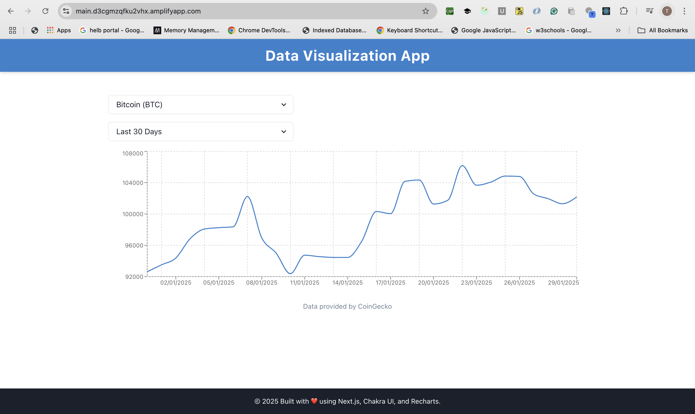

# Frontend Developer Assessment

## Project Description
This is a responsive and interactive web application built using **Next.js**, **Chakra UI**, and **Recharts**. The app fetches data from the [JSONPlaceholder API](https://jsonplaceholder.typicode.com/), visualizes it using charts, and allows users to filter the data for specific insights. The application is deployed on **AWS Amplify**.

**Live Demo**: [https://main.d3cgmzqfku2vhx.amplifyapp.com/](https://main.d3cgmzqfku2vhx.amplifyapp.com/)

---

## Features
- **Data Fetching**: Fetches posts data from JSONPlaceholder API.
- **Data Visualization**: Displays the data in a line chart using Recharts.
- **User Interaction**: Allows users to filter data by `title`.
- **Responsive Design**: Built with Chakra UI for a seamless experience across devices.
- **Modular Components**: Reusable and well-structured components for maintainability.

---

## Technologies Used
- **Frontend Framework**: [Next.js](https://nextjs.org/)
- **UI Component Library**: [Chakra UI](https://chakra-ui.com/)
- **Charting Library**: [Recharts](https://recharts.org/)
- **Hosting Platform**: [AWS Amplify](https://aws.amazon.com/amplify/)

---

## Installation and Usage

### Prerequisites
- Node.js (v19 or higher)
- npm (v10 or higher)

### Steps to Run Locally
1. Clone the repository:
   ```bash
   git clone https://github.com/Tinega-Devops/frontend-assessment.git
   cd frontend-assessment
   ```
2. Install dependencies:
   ```bash
   npm install
   ```
3. Run the development server:
   ```bash
   npm run dev
   ```
4. Open your browser and navigate to `http://localhost:3000`.

---

## Project Structure
```
frontend-assessment/
├── components/
│   ├── ChartArea.ts        # Recharts component for data visualization
│   ├── Filters.tsx       # Filter component for user interaction
│   ├── Header.tsx       # Header component
│   └── Footer.tsx       # Footer component
├── app/
│   ├── pages.tsx        # Main page with data fetching and rendering
│   └── layout.tsx        # A page for displaying the app layout 
│   └── providers.tsx     # API routes (if needed)
├── public/               # Contains all the static resources for the app
├── service/
│   └── api.js          # API service for fetching data
├── styles/
│   └── globals.css     # Global styles
├── README.md           # Project documentation
├── package.json        # Project dependencies
└── tsconfig.json        # TypeScript configuration
└── next.config.ts      # Next.js configuration
```

---

## Known Issues
- The API has a limited dataset, so filtering options are restricted to available `title`s.
- The chart may not display optimally on very small screens (e.g., mobile devices).

---

## Future Improvements
- Add more chart types (e.g., line chart, pie chart) for better data visualization.
- Implement pagination or lazy loading for large datasets.
- Enhance error handling for API failures.
- Add unit tests and integration tests for better code reliability.

---

## Screenshots



---

## License
This project is open-source does not require license.
